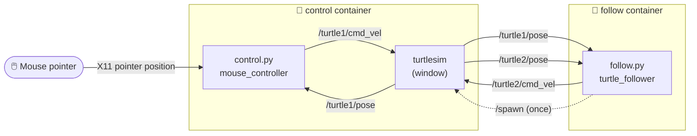

# 🐢 nova-onramp

**Drive a ROS 2 turtle with your mouse, and watch a second turtle chase it.**


A small ROS 2 project built on [turtlesim](https://docs.ros.org/en/humble/Tutorials/Beginner-CLI-Tools/Introducing-Turtlesim/Introducing-Turtlesim.html).
Everything runs in Docker: ROS 2 Humble is built from source inside the image,
so you don't need ROS installed on your computer.

| | |
|---|---|
| 🖱️ **Mouse control** | Move the pointer over the TurtleSim window and `turtle1` drives to it. |
| 🐢 **Follower** | `turtle2` spawns and trails `turtle1`, keeping about 1 unit behind. |
| 🐳 **Two containers** | Each program runs in its own container, from one image. |

---

## 🗺️ How it works



- **`control.py`** reads where the pointer is over the TurtleSim window, turns that
  into a spot in the turtle's world, and steers `turtle1` there using its pose.
- **`follow.py`** asks turtlesim to spawn `turtle2`, then steers it toward `turtle1`,
  stopping when it gets close.
- Both steer the same way: turn toward the target, and drive forward faster
  the farther away it is, but only while facing it.

---

## 🚀 Quick start

### Requirements

- Docker with Docker Compose
- A display the container can draw on. On **Windows**, use WSL 2 with WSLg
  (Windows 11 has it built in). On **Linux**, a normal desktop works.

### 1. Build the image

```bash
docker compose build
```

The first build compiles ROS 2 from source and can take a while.
After that, rebuilds take seconds.

> [!NOTE]
> The Python files are copied into the image, so run `docker compose build` again
> after you change them.

### 2. Run it (one terminal each)

```bash
# Terminal 1: opens turtlesim, turtle1 follows your mouse
docker compose run --rm control
```

```bash
# Terminal 2: spawns turtle2, which follows turtle1
docker compose run --rm follow
```

Move your mouse over the TurtleSim window. Press **Ctrl+C** in a terminal to stop that container.

> [!TIP]
> To start both at once in one terminal, run `docker compose up`.

---

## 📁 Project layout

```
nova-onramp/
├── Dockerfile        # Ubuntu 22.04 + ROS 2 Humble (built from source) + our code
├── compose.yaml      # the control and follow containers, with all run flags
├── entrypoint.sh     # loads ROS before running any command in the container
├── control.sh        # launcher: turtlesim + control.py
├── follow.sh         # launcher: follow.py
└── ros2_ws/
    ├── control.py    # turtle1 follows the mouse pointer
    └── follow.py     # spawns turtle2, which follows turtle1
```

---

## ⚙️ Tuning

| Setting | File | Default | What it does |
|---|---|---|---|
| `ARRIVE_DIST` | `control.py` | `5 / 45` | How close `turtle1` gets to the pointer before stopping (about 5 px). |
| `FOLLOW_DIST` | `follow.py` | `1.0` | How far `turtle2` stays behind `turtle1`. |
| `4.0 * err` | both | `4.0` | How sharply the turtle turns. Higher is snappier. |
| `min(2.0, ...)` | both | `2.0` | Top forward speed. |

---

## 🛠️ Troubleshooting

<details>
<summary><b>"Can't connect to display" / no turtlesim window</b></summary>

The container can't reach your screen. Check that `echo $DISPLAY` prints something
(like `:0`) in the terminal you run Docker from. On Windows, run the commands inside
WSL, not PowerShell.
</details>

<details>
<summary><b>turtle2 never appears, or doesn't move</b></summary>

Start `control` first; `follow` waits until turtlesim is running.
Both containers need `network_mode: host` and `ipc: host` (already in `compose.yaml`).
ROS 2 passes messages between nodes on the same machine through shared memory,
so without `ipc: host` the containers can see each other's topics but get no messages.
</details>

<details>
<summary><b>The turtle doesn't follow the mouse</b></summary>

The pointer has to be over the TurtleSim window itself. When it leaves the
window, `turtle1` stops on purpose.
</details>

<details>
<summary><b>Useful ROS commands</b></summary>

With the containers running, open a shell next to them:

```bash
docker compose run --rm follow bash
```

Then:

```bash
ros2 node list                       # see running nodes
ros2 topic echo /turtle1/pose        # watch turtle1's position
ros2 topic echo /turtle1/cmd_vel     # watch the drive commands
```
</details>

---

## 📄 License

[MIT](LICENSE) © 2026 Khoa Nguyen
